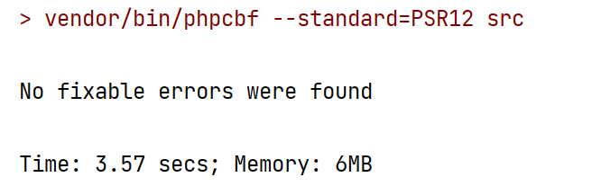

#### Patterns, that I used in my solution of the task:
* Facade in [Bank](src%2FBank.php) class to provide simple interface to complex financial system
* Intermediary in [Bank](src%2FBank.php) to pass the result of transaction processing to the transaction repository and persist it
* Strategy in [TransactionsProcessor](src%2FTransactionsProcessors%2FTransactionsProcessor.php) to shift responsibility of transaction processing out of Account and Transaction also. We can implement many other processing strategies depending on tasks
* Repository in [AccountRepositoryInterface](src%2FRepositories%2FAccountRepository%2FAccountRepositoryInterface.php), [TransactionRepositoryInterface](src%2FRepositories%2FTransactionRepository%2FTransactionRepositoryInterface.php) to encapsulate logic of persistence layer
* Command in [ProcessableTransactionInterface](src%2FTransactions%2FProcessableTransactions%2FProcessableTransactionInterface.php) to encapsulate business logic of transactions in `process()` method. In this pattern, the [TransactionsProcessor](src%2FTransactionsProcessors%2FTransactionsProcessor.php) plays the role of the invoker
* Composite in [CompositeTransactionInterface](src%2FTransactions%2FProcessableTransactions%2FCompositeTransactions%2FCompositeTransactionInterface.php) to split complex TransferTransaction into a simple Withdraw and Deposit
* ValueObject in Money class to implement money
* DTO in [TransactionData](src%2FTransactions%2FTransactionData.php) to wrap range of objects and reduce complexity of Transaction's constructor signature
* Entity in [CompletedTransactionInterface](src%2FTransactions%2FCompletedTransactions%2FCompletedTransactionInterface.php) and in [Account](src%2FAccount%2FAccount.php) for their identification and ability to perform persistence operations

